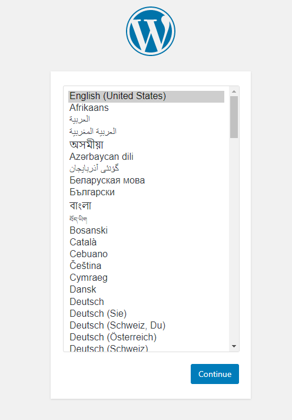

# WordPress Environment

サンプルコードをダウンロード

```
git clone https://github.com/oracle-japan/jp-cloudnative-study-group.git
```

# Secret Setup

データベースのパスワードを格納するKubernetesシークレットを作成します。

```
kubectl create secret generic mysql --from-literal=password=mysql-p@ssw0d
```
```
secret/mysql created
```
```
kubectl get secrets
```
```
NAME    TYPE     DATA   AGE
mysql   Opaque   1      28s
```

## NFS Setup

```
cd jp-cloudnative-study-group/Container-Orchestration/nfs
```
```
ls
```
```
nfs-pvc.yaml  nfs-server.yaml  nfs-service.yaml
```

PVCとPVの作成

```
kubectl apply -f nfs-pvc.yaml
```
```
persistentvolumeclaim/nfs-pvc created
```

STATUSはPendingとなります。

```
kubectl get pvc
```
```
NAME      STATUS    VOLUME   CAPACITY   ACCESS MODES   STORAGECLASS   AGE
nfs-pvc   Pending                                      oci-bv         26s
```

NFS Deployment を適用

```
kubectl apply -f nfs-server.yaml
```
```
deployment.apps/nfs-server created
```

PVCとPVがBOUND状態であること確認します。

```
kubectl get pv,pvc
```
```
NAME                                                        CAPACITY   ACCESS MODES   RECLAIM POLICY   STATUS   CLAIM             STORAGECLASS   REASON   AGE
persistentvolume/csi-d7107824-99d8-4658-8824-ca2401723066   50Gi       RWO            Delete           Bound    default/nfs-pvc   oci-bv                  82s

NAME                            STATUS   VOLUME                                     CAPACITY   ACCESS MODES   STORAGECLASS   AGE
persistentvolumeclaim/nfs-pvc   Bound    csi-d7107824-99d8-4658-8824-ca2401723066   50Gi       RWO            oci-bv         3m22s
```

NFS PodのステータスがRunningであることを確認

```
kubectl get pods
```
```
NAME                          READY   STATUS    RESTARTS   AGE
nfs-server-754d98f49b-zmfld   1/1     Running   0          2m37s
```

NFS Serviceを適用

```
kubectl apply -f nfs-service.yaml
```
```
service/nfs-service created
```
```
kubectl get services
```
```
NAME          TYPE        CLUSTER-IP      EXTERNAL-IP   PORT(S)                      AGE
kubernetes    ClusterIP   10.96.0.1       <none>        443/TCP,12250/TCP            23h
nfs-service   ClusterIP   10.96.110.166   <none>        2049/TCP,20048/TCP,111/TCP   7s
```

## PersistentVolume & PersistentVolumeClaim Setup

WordPressとMySQLのPVとPVCを作成します。
PVはNFSを利用します。

```
cd ../pv-pvc
```
```
ls
```
```
mysql-pvc.yaml  mysql-pv.yaml  wordpress-pvc.yaml  wordpress-pv.yaml
```

WordPressとMySQLのマニフェストファイルにNFS ServiceのIPアドレスを定義します。
最初にNFS ServiceのCLUSTER-IPを確認します。

```
kubectl get services
```
```
NAME          TYPE        CLUSTER-IP      EXTERNAL-IP   PORT(S)                      AGE
kubernetes    ClusterIP   10.96.0.1       <none>        443/TCP,12250/TCP            23h
nfs-service   ClusterIP   10.96.110.166   <none>        2049/TCP,20048/TCP,111/TCP   5m30s
```

「xx.xx.xx.xx」を確認したCLUSTER-IPに変更します。

```
vim mysql-pv.yaml
```
```
apiVersion: v1
kind: PersistentVolume
metadata:
  name: mysql-pv
  labels:
    type: local
spec:
  storageClassName: mysql
  capacity:
    storage: 10Gi
  accessModes:
    - ReadWriteMany
  nfs:
    server: xx.xx.xx.xx
    path: /
```

```
vim wordpress-pv.yaml
```
```
apiVersion: v1
kind: PersistentVolume
metadata:
  name: wordpress-pv
  labels:
    type: local
spec:
  storageClassName: wordpress
  capacity:
    storage: 10Gi
  accessModes:
    - ReadWriteMany
  nfs:
    server: xx.xx.xx.xx
    path: /
```

PVとPVCを適用します。

```
kubectl apply -f mysql-pv.yaml
```
```
persistentvolume/mysql-pv created
```
```
kubectl apply -f mysql-pvc.yaml
```
```
persistentvolumeclaim/mysql-pvc created
```

```
kubectl apply -f wordpress-pv.yaml
```
```
persistentvolume/wordpress-pv created
```
```
kubectl apply -f wordpress-pvc.yaml
```
```
persistentvolumeclaim/wordpress-pvc created
```

PVとPVCがBound状態であることを確認します。

```
kubectl get pv,pvc
```
```
NAME                                                        CAPACITY   ACCESS MODES   RECLAIM POLICY   STATUS   CLAIM                   STORAGECLASS   REASON   AGE
persistentvolume/csi-d7107824-99d8-4658-8824-ca2401723066   50Gi       RWO            Delete           Bound    default/nfs-pvc         oci-bv                  27m
persistentvolume/mysql-pv                                   10Gi       RWX            Retain           Bound    default/mysql-pvc       mysql                   3m11s
persistentvolume/wordpress-pv                               10Gi       RWX            Retain           Bound    default/wordpress-pvc   wordpress               2m44s

NAME                                  STATUS   VOLUME                                     CAPACITY   ACCESS MODES   STORAGECLASS   AGE
persistentvolumeclaim/mysql-pvc       Bound    mysql-pv                                   10Gi       RWX            mysql          61s
persistentvolumeclaim/nfs-pvc         Bound    csi-d7107824-99d8-4658-8824-ca2401723066   50Gi       RWO            oci-bv         29m
persistentvolumeclaim/wordpress-pvc   Bound    wordpress-pv                               10Gi       RWX            wordpress      34s
```

## WordPress & MySQL Setup

WordPressとMySQLのPodとServiceを適用します。

```
cd ../wp-ms/
```
```
kubectl apply -f mysql.yaml
```
```
deployment.apps/mysql created
```
```
kubectl apply -f mysql-service.yaml
```
```
service/mysql-service created
```

```
kubectl apply -f wordpress.yaml
```
```
deployment.apps/wordpress created
```
```
kubectl apply -f wordpress-service.yaml
```
```
service/wordpress-service created
```

```
kubectl get pods
```
```
NAME                          READY   STATUS    RESTARTS   AGE
mysql-c468c5548-bh6t5         1/1     Running   0          4m19s
nfs-server-754d98f49b-zmfld   1/1     Running   0          39m
wordpress-74d8c99c7f-p2l9h    1/1     Running   0          3m41s
```

WordPress Serviceには、EXTERNAL-IPが割り当てられます。
ブラウザからアクセスするとWordPressの初期セットアップ画面が表示されます。

```
kubectl get services
```
```
NAME                TYPE           CLUSTER-IP      EXTERNAL-IP   PORT(S)                      AGE
kubernetes          ClusterIP      10.96.0.1       <none>        443/TCP,12250/TCP            24h
mysql-service       ClusterIP      10.96.9.193     <none>        3306/TCP                     91s
nfs-service         ClusterIP      10.96.110.166   <none>        2049/TCP,20048/TCP,111/TCP   40m
wordpress-service   LoadBalancer   10.96.45.59     138.xx.xx.xx  80:31920/TCP                 60s
```

```
http://138.xx.xx.xx/
```



## Delete

WordPressとMySQLのDeploymentとServiceを削除します。

```
kubectl delete -f wordpress-service.yaml
```
```
service "wordpress-service" deleted
```
```
kubectl delete -f wordpress.yaml
```
```
deployment.apps "wordpress" deleted
```
```
kubectl delete -f mysql-service.yaml
```
```
service "mysql-service" deleted
```
```
kubectl delete -f mysql.yaml
```
```
deployment.apps "mysql" deleted
```

WordPressとMySQLのPVとPVCを削除します。

```
kubectl delete pvc wordpress-pvc
```
```
persistentvolumeclaim "wordpress-pvc" deleted
```
```
kubectl delete pvc mysql-pvc
```
```
persistentvolumeclaim "mysql-pvc" deleted
```
```
kubectl delete pv wordpress-pv
```
```
persistentvolume "wordpress-pv" deleted
```
```
kubectl delete pv mysql-pv
```
```
persistentvolume "mysql-pv" deleted
```

NFSのDeploymentとServiceとPVCを削除します。

```
kubectl delete service nfs-service
```
```
service "nfs-service" deleted
```
```
kubectl delete deployment nfs-server
```
```
deployment.apps "nfs-server" deleted
```
```
kubectl delete pvc nfs-pvc
```
```
persistentvolumeclaim "nfs-pvc" deleted
```

Secretを削除します。

```
kubectl delete secret mysql
```
```
secret "mysql" deleted
```

削除できたことを確認します。

```
kubectl get secrets
```
```
No resources found in default namespace.
```
```
kubectl get pods
```
```
No resources found in default namespace.
```
```
kubectl get services
```
```
NAME         TYPE        CLUSTER-IP   EXTERNAL-IP   PORT(S)             AGE
kubernetes   ClusterIP   10.96.0.1    <none>        443/TCP,12250/TCP   25h
```
```
kubectl get pv,pvc
```
```
No resources found
```